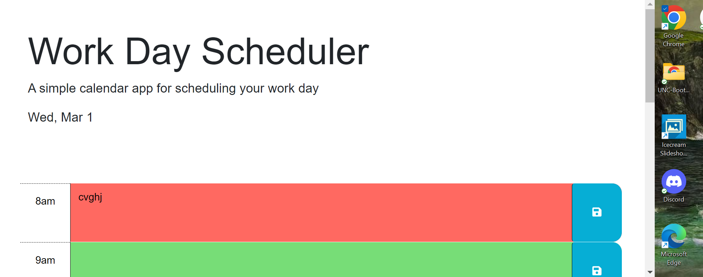

# work-day-scheduler

This is a scheduler app developed for the UNC Coding Bootcamp

## Usage

Enter your task into the fields for the hour and click save
Click the trash icon to remove task

## Contributing

Pull requests are welcome. For major changes, please open an issue first
to discuss what you would like to change.

Please make sure to update tests as appropriate.

## Deployed Application

https://brandon5667.github.io/work-day-scheduler/

## Screenshot

